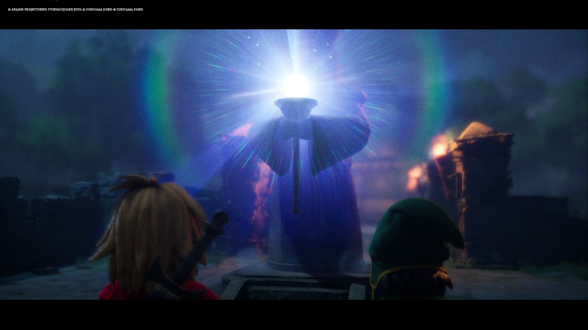
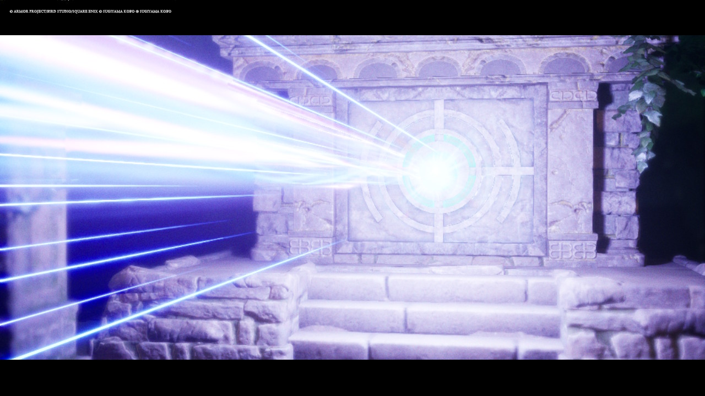
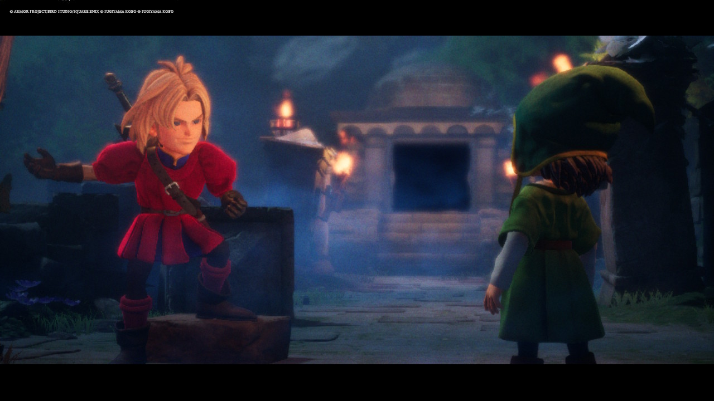
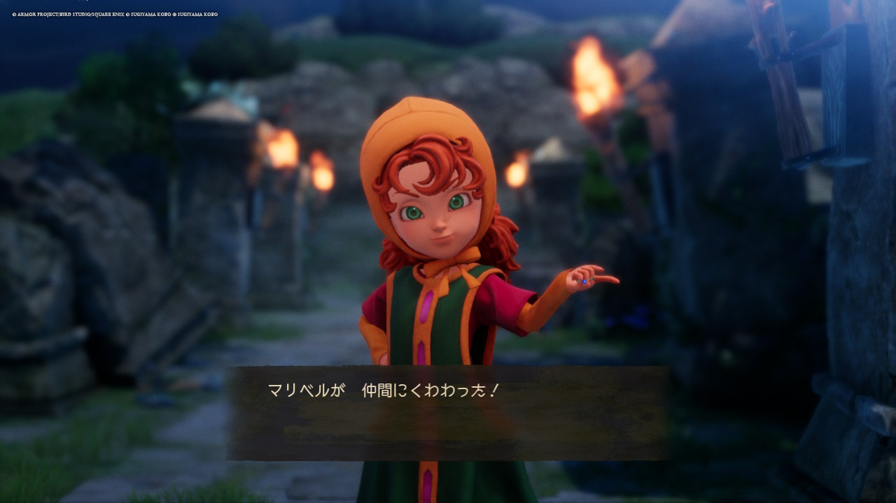

Title: ドラクエ7リメイク、東の神殿でついにマリベルちゃんと合流！
Category: ゲーム
Tags: ドラクエ, Nintendo Switch
Slug: dragon-quest-vii-play-0120
Image: images/dq-viire-20260114-8.jpg
Summary: 今日もドラクエ7リメイクをプレイ！ついに東の神殿でマリベルちゃんと合流できましたよ！！

## いざ、東の神殿へ！

幾多の試練を乗り越え、とうとう4つの石版を集めきることができました！！

本日は早速、東の神殿へ行き、4つの石版のかけらを賢者の像に捧げに行きたいと思います！！

いやあ、石版のかけら集めの試練は、本当に難しかったですね！！まさか、初回の戦闘から全滅するとは思いませんでしたよ！

神殿の賢者の像に石版を捧げると、まばゆい光が……！この光景、何度見ても鳥肌が立ちます。リメイク版のライティング、本当に綺麗ですよね。

## 賢者の像が導く先には…

賢者の像に祈りを捧げると、まばゆい光の光線が神殿の扉に！！

キーファとともに覚悟を決めて神殿の中に向かいます！！

## ついに、マリベルちゃんが仲間に！

そして、この時を待っていました！！神殿の中に入ろうとすると…！

**「マリベルが 仲間にくわわった！」**

ついに！ついにマリベルちゃんとの合流です！
相変わらずのツンデレ気味なセリフも健在で、「これぞドラクエ7！」という実感が湧いてきます。パーティが賑やかになると、戦略の幅も広がって戦闘がグッと楽しくなりますよね。

## 冒険はまだまだこれから！

マリベルが加わり、ようやく「旅の一行」という形が整いました。
次に待ち受けるのはどんな世界なのか？ 石版の謎は解けるのか？ 

寄り道ばかりしてしまっていますが（笑）、マイペースにエスタード島の外の世界を冒険していこうと思います！

本日は以上です！またお会いしましょう！ではまた！